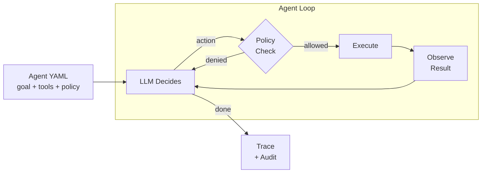

# Operon

**Agentic Automation Platform** — Define goals. Execute with control.

Operon is a platform for executing autonomous actions in production systems under strict policies, with full auditability.

## Project Structure

```
operon/
├── agentctl/                    # Agent Runner — the core runtime
├── tools/                       # Tool plugins (each is a separate pip package)
│   ├── operon-tool-kubectl/     # Kubernetes (real kubectl, intent-based)
│   ├── operon-tool-websearch/   # Web search + fetch (DuckDuckGo)
│   ├── operon-tool-weather/     # Weather tool (mock)
│   └── operon-tool-k8s/        # Kubernetes tool (mock, legacy)
└── README.md
```

## Components

| Component | Description | Status |
|-----------|-------------|--------|
| [**agentctl**](agentctl/) | CLI runtime — loads agent specs, runs the decision loop, enforces policies | MVP |
| [**operon-tool-kubectl**](tools/operon-tool-kubectl/) | Kubernetes operations via kubectl (intent-based, read/write tagged) | MVP |
| [**operon-tool-websearch**](tools/operon-tool-websearch/) | Web search (DuckDuckGo) and page fetching | MVP |
| [**operon-tool-weather**](tools/operon-tool-weather/) | Weather conditions and forecasts | MVP (mock) |
| **Control Plane** | Manages agents, coordinates execution, centralizes policies | Planned |

## Quick Start

```bash
# Install the runtime and tools
python3 -m venv .venv && source .venv/bin/activate
pip install -e agentctl/ -e tools/operon-tool-websearch/ -e tools/operon-tool-kubectl/

# Run a research agent
agentctl run agentctl/examples/agent-research.yaml -e question="Best restaurants in Tarragona"

# Run a weather agent
agentctl run agentctl/examples/agent-websearch-weather.yaml -e city="Barcelona, Spain"

# Run a K8s investigator (requires kubectl configured)
agentctl run agentctl/examples/agent-kubectl.yaml -e namespace=production

# Stream events in real-time
agentctl run agentctl/examples/agent-research.yaml -o ndjson -e question="..."
```

## How it works



1. Define an agent in YAML (goal, tools, policy, LLM provider)
2. `agentctl run agent.yaml`
3. The loop runs: **decide → policy check → approve → execute → observe**
4. Every step is traced for auditability

See [docs/architecture.md](docs/architecture.md) for detailed diagrams.

## Tools are plugins

Tools are separate packages that agentctl discovers automatically via Python entry points. Anyone can create and publish their own:

```bash
pip install operon-tool-kubectl      # Kubernetes (real kubectl)
pip install operon-tool-websearch    # Web search + fetch
pip install operon-tool-weather      # Weather (mock)
pip install operon-tool-aws          # AWS (future)
pip install operon-tool-github       # GitHub (future)
```

See [agentctl/README.md](agentctl/README.md) for full documentation on creating tools and providers.

## Testing

```bash
source .venv/bin/activate
pip install -e "agentctl/[dev]"
cd agentctl && python -m pytest tests/ -v
```

Tests cover the safety-critical components: policy engine (mode enforcement, allowed actions, denied patterns), JSON extraction from LLM responses, and tool registry (namespacing, filtering, routing).

## Docs

| Document | Description |
|----------|-------------|
| [agentctl/README.md](agentctl/README.md) | Full runtime documentation — CLI, spec reference, tools, providers |
| [docs/architecture.md](docs/architecture.md) | Architecture diagrams — agent loop, data flow, plugin system, policy |
| [docs/recipes.md](docs/recipes.md) | Design doc for community-shared agent recipes (planned) |
