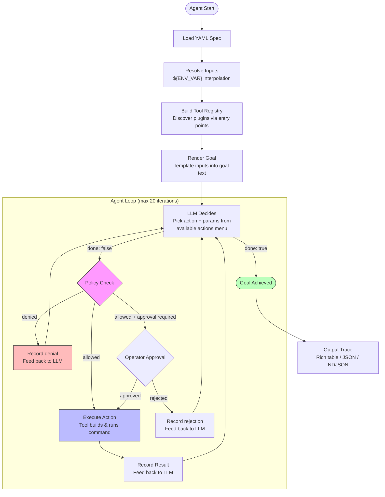
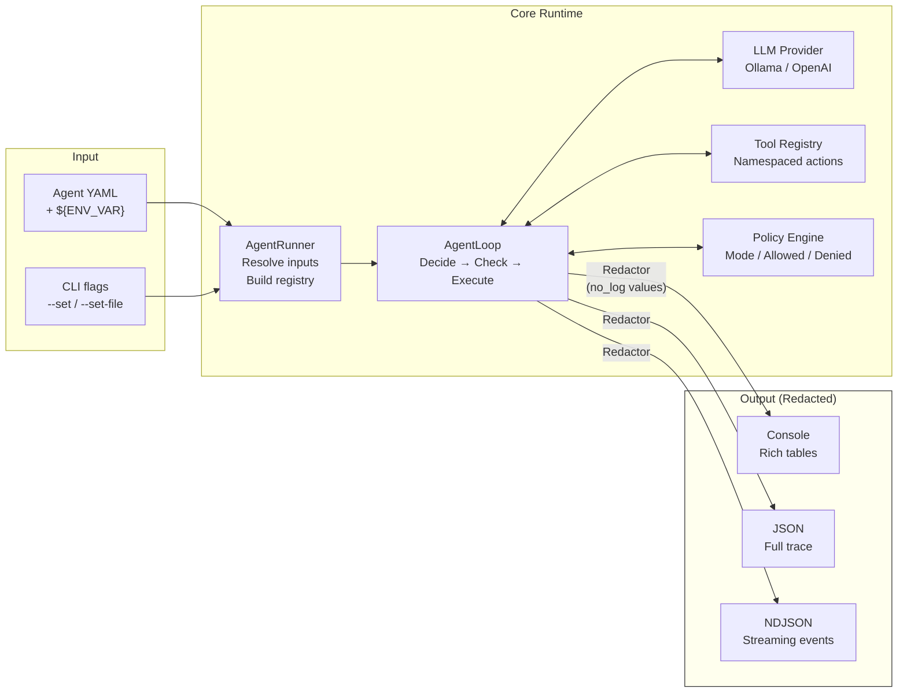
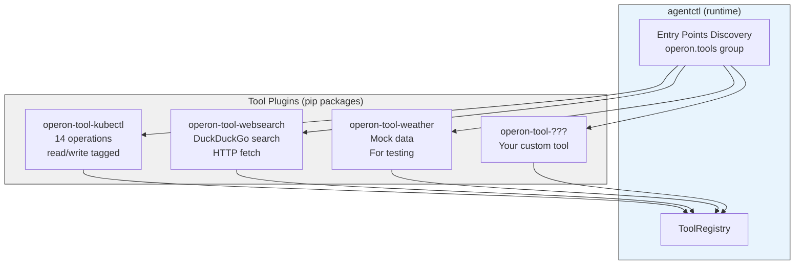
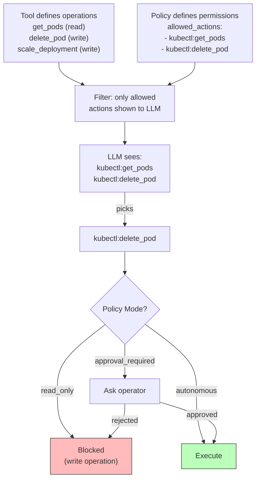

# Architecture

## Agent Loop

The core execution model. Every agent follows this loop until the goal is achieved or limits are reached.

## Data Flow

How data moves through the system, and where redaction happens.

## Plugin System

Tools are separate pip packages discovered automatically via Python entry points.

## Policy Enforcement

Tools define capability, policy defines permissions. Single source of truth.

