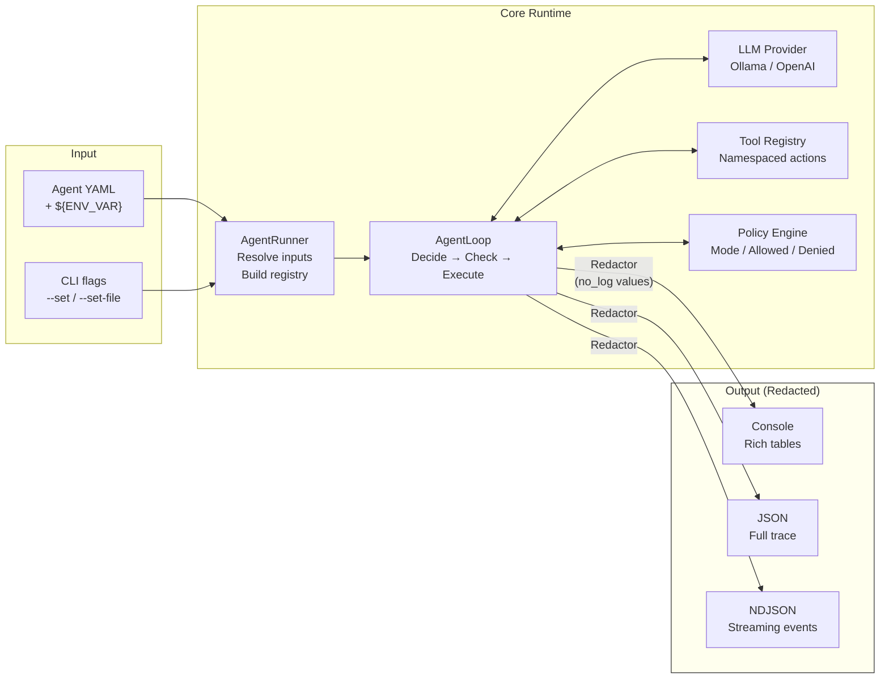
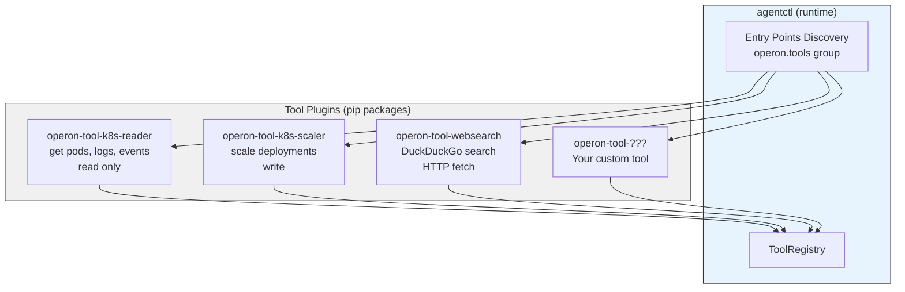
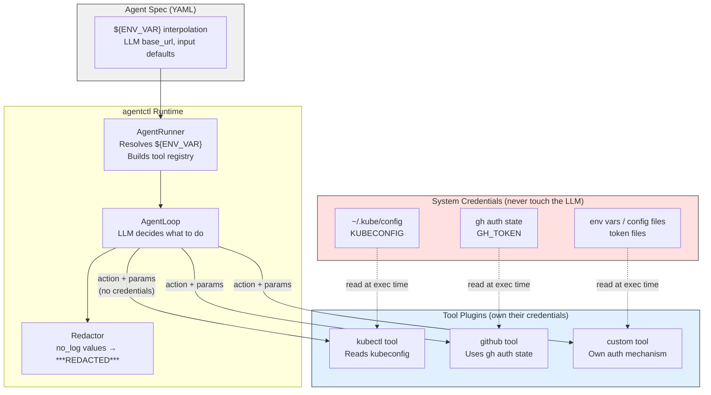
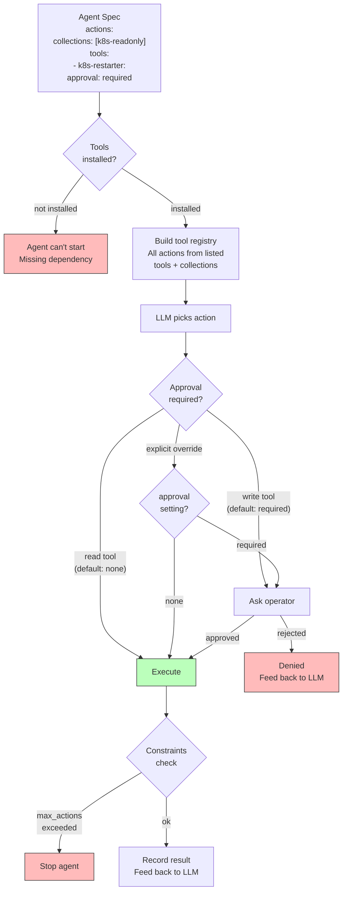

# Architecture

## Agent Loop

The core execution model. Every agent follows this loop until the goal is achieved or limits are reached.


## Data Flow

How data moves through the system, and where redaction happens.



## Tool Design Philosophy

Operon is opinionated about tools: **each tool should do one thing, and its blast radius should be obvious from the name.**

The operator controls what an agent can do by choosing which tools to install — not by editing policy whitelists. If the operator doesn't install a write tool, the agent can't write. Policy exists as defense-in-depth, not as the primary control.

```
Good: fine-grained, obvious blast radius
├── operon-tool-k8s-reader        # pods, logs, events — can't break anything
├── operon-tool-k8s-scaler        # scale deployments — clearly a write tool
├── operon-tool-k8s-restarter     # rolling restarts only
├── operon-tool-github-reader     # issues, PRs, releases — read-only
├── operon-tool-github-triage     # add labels, comment — lightweight writes
└── operon-tool-github-merge      # merge PRs — powerful, opt-in

Bad: broad tools that hide dangerous operations
└── operon-tool-kubectl           # 14 operations, mix of read and write
```

### Why fine-grained?

1. **Install = opt-in.** The operator installs `k8s-reader` for an investigator agent. No risk of accidental writes — the tool simply can't do them.
2. **Auditable from the outside.** `pip list | grep operon-tool` shows exactly what an agent can do. No need to read YAML policy to understand the blast radius.
3. **Composable.** An incident response recipe depends on `k8s-reader` + `k8s-restarter`. A monitoring recipe depends on `k8s-reader` only. Each recipe declares the minimum tools it needs.
4. **Community-friendly.** Tool authors build small, focused packages. Reviewers can audit a 50-line tool, not a 500-line Swiss Army knife.

### Guidelines for tool authors

- **One concern per tool.** A tool that reads and writes is two tools.
- **Name reveals intent.** `k8s-reader`, not `k8s`. `github-merge`, not `github`.
- **Default to read-only.** Most tools should be read-only. Write tools are separate packages that operators install deliberately.
- **Minimal surface area.** Fewer actions = easier to audit, easier to trust.

## Plugin System

Tools are separate packages discovered automatically via Python entry points.



## Credential Model

Tools consume their own credentials. The agent spec handles configuration (LLM endpoints, input defaults) — not tool authentication.



The LLM decides **what** to do (action + params). The tool decides **how** to authenticate. Credentials are resolved at execution time by the tool itself — the agent spec has no `credentials` field and no way to inject auth into a tool.

## Safety Model

Safety comes from three layers: tool selection, per-tool approval, and constraints.



**Layer 1: Tool selection.** The agent lists tools and collections in `actions`. If a tool isn't listed, the LLM never sees it. If it's not installed, the agent can't start.

**Layer 2: Per-tool approval.** Each tool can set `approval: required` or `approval: none`. Defaults: read tools → none, write tools → required. The approval decision lives next to the tool, not in a separate policy block.

**Layer 3: Constraints.** Hard limits — `max_actions` caps total actions per run, `denied_patterns` blocks specific patterns via regex. Defense-in-depth.
