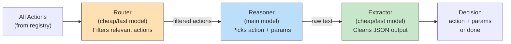
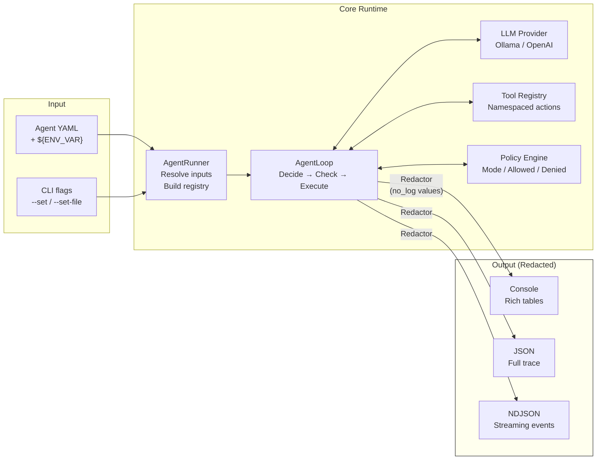
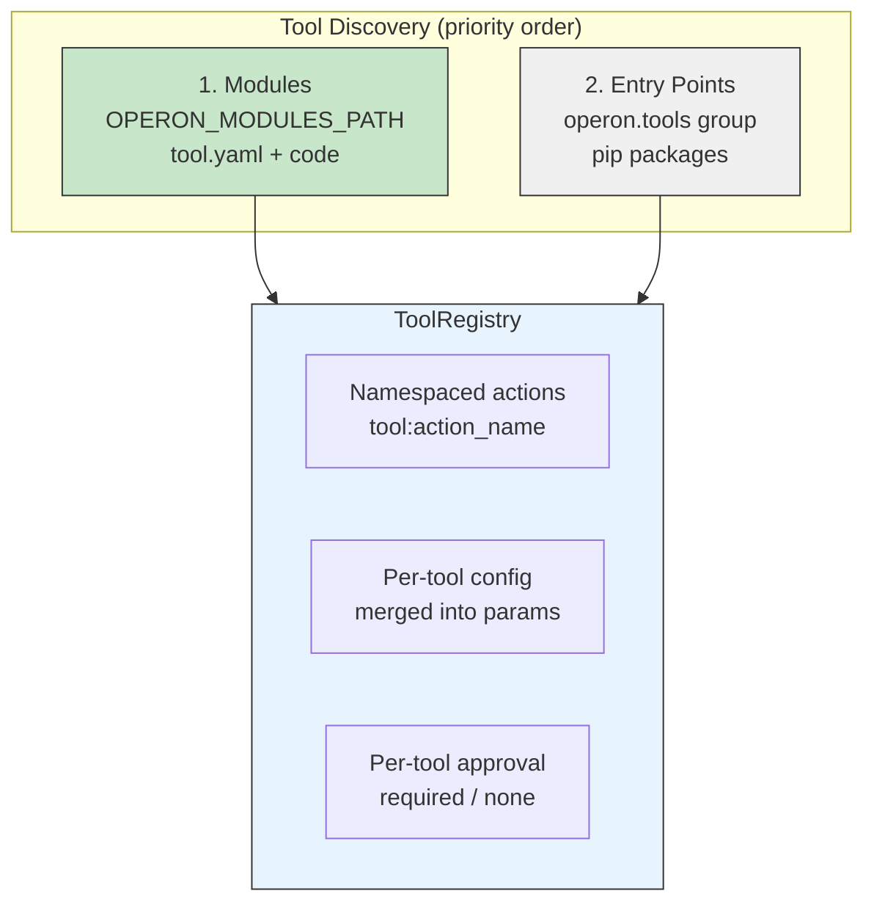
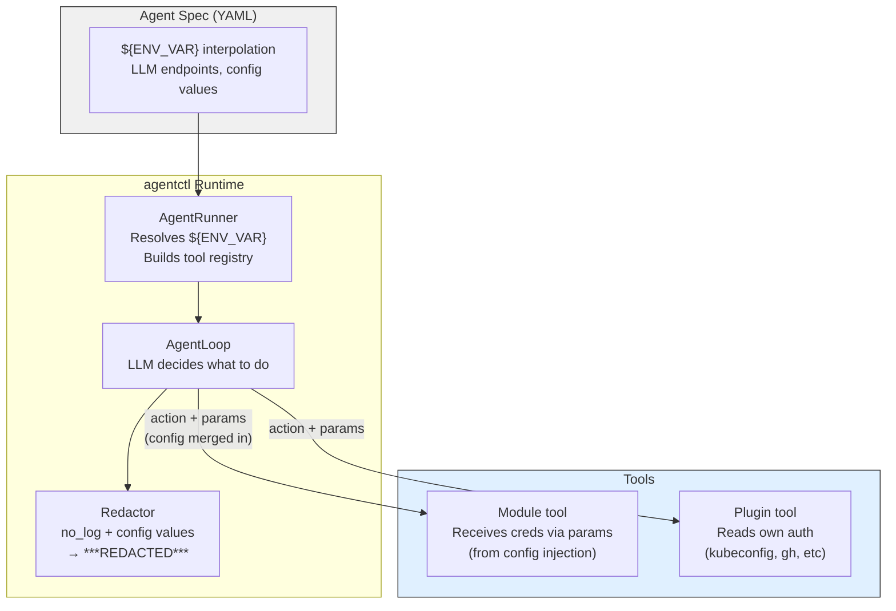
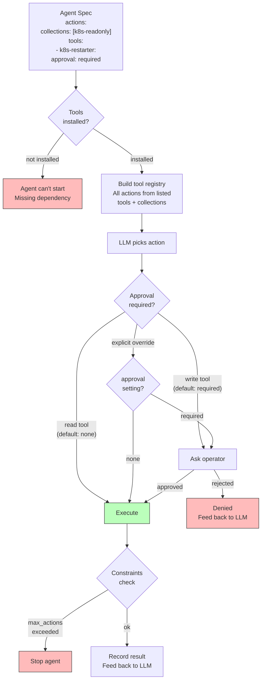

# Architecture

## Agent Loop

The core execution model. Every agent follows this loop until the goal is achieved or limits are reached.


## Decision Engine — Three-Layer Architecture

The decision engine supports three optional layers, each configurable with its own model, provider, and temperature:



**Router** (optional): A fast model that receives the goal, action names/descriptions, and recent history. Returns a subset of relevant actions. Reduces noise for the reasoner when many tools are registered. Falls back to the full action list on failure.

**Reasoner** (required): The main model. Receives the goal, actions (filtered or full), and execution history. Decides what to do next.

**Extractor** (optional): A fast model that takes the reasoner's raw output and extracts clean JSON. Useful when the reasoner model doesn't reliably produce structured output.

Each layer can have its own `provider`, `model`, `base_url`, and `temperature`:

```yaml
decision:
  type: llm
  provider: ollama
  model: qwen3:14b
  base_url: http://192.168.1.139:11434/v1
  temperature: 0.7
  max_history: 5              # trim old history for small-context models

  router:
    model: qwen3:1.7b
    temperature: 0.3

  extractor:
    model: qwen3:1.7b
    temperature: 0.1
```

Router and extractor inherit `provider` and `base_url` from the top level if not specified. `max_history` limits how many past actions are sent to the LLM — only the most recent N entries are included. All layers are optional — the simplest config is just `provider` + `model`, which acts as the reasoner.

## Data Flow

How data moves through the system, and where redaction happens.



## Tool Design Philosophy

Operon is opinionated about tools: **each tool should do one thing, and its blast radius should be obvious from the name.**

The operator controls what an agent can do by choosing which tools to install — not by editing policy whitelists. If the operator doesn't install a write tool, the agent can't write. Policy exists as defense-in-depth, not as the primary control.

```
Good: fine-grained, obvious blast radius
├── operon-tool-k8s-reader        # pods, logs, events — can't break anything
├── operon-tool-k8s-scaler        # scale deployments — clearly a write tool
├── operon-tool-k8s-restarter     # rolling restarts only
├── operon-tool-github-reader     # issues, PRs, releases — read-only
├── operon-tool-github-triage     # add labels, comment — lightweight writes
└── operon-tool-github-merge      # merge PRs — powerful, opt-in

Bad: broad tools that hide dangerous operations
└── operon-tool-kubectl           # 14 operations, mix of read and write
```

### Why fine-grained?

1. **Install = opt-in.** The operator installs `k8s-reader` for an investigator agent. No risk of accidental writes — the tool simply can't do them.
2. **Auditable from the outside.** `pip list | grep operon-tool` shows exactly what an agent can do. No need to read YAML policy to understand the blast radius.
3. **Composable.** An incident response recipe depends on `k8s-reader` + `k8s-restarter`. A monitoring recipe depends on `k8s-reader` only. Each recipe declares the minimum tools it needs.
4. **Community-friendly.** Tool authors build small, focused packages. Reviewers can audit a 50-line tool, not a 500-line Swiss Army knife.

### Guidelines for tool authors

- **One concern per tool.** A tool that reads and writes is two tools.
- **Name reveals intent.** `k8s-reader`, not `k8s`. `github-merge`, not `github`.
- **Default to read-only.** Most tools should be read-only. Write tools are separate packages that operators install deliberately.
- **Minimal surface area.** Fewer actions = easier to audit, easier to trust.

## Tool System

Tools are discovered from two sources: **modules** (self-contained directories) and **entry points** (pip packages). Modules take precedence.

### Modules

A module is a directory with a `tool.yaml` manifest and code in Python or Go:

```
weather-reader/
├── tool.yaml       # name, runtime, actions, params
└── main.py         # execute(action, params) -> str
```

```yaml
# tool.yaml
name: weather-reader
runtime: python          # or golang
entrypoint: main.py      # or ./binary
actions:
  - name: get_weather
    type: read
    description: Get current weather for a city
    params:
      city: { type: string, required: true }
```

Modules are discovered from `OPERON_MODULES_PATH` (default: `/usr/lib/operon/modules/`). Python modules are loaded in-process; Go modules communicate via JSON over stdin/stdout.

### Per-Tool Config

Credentials and configuration can be injected into tools via the `config` field in the agent spec. Config values are merged into action params at execution time, so modules receive credentials as params rather than reading environment variables directly.

```yaml
actions:
  tools:
    - telegram-sender:
        approval: required
        config:
          bot_token: ${TELEGRAM_BOT_TOKEN}
          chat_id: ${TELEGRAM_CHAT_ID}
```

Config values are automatically added to the redactor so they don't leak in traces.

### Entry Points (fallback)

Tools can also be pip packages discovered via `operon.tools` entry points. This is the original mechanism, kept as a fallback for tools that need Python packaging.



## Credential Model

Two credential patterns are supported:

**System credentials** — tools like kubectl and gh read their own auth from the environment (kubeconfig, `GH_TOKEN`). The agent spec doesn't know about these.

**Config injection** — for modules that need credentials (API tokens, chat IDs), the agent spec injects them via the `config` field. Values are resolved from `${ENV_VAR}` at load time, merged into action params at execution time, and automatically redacted from traces.



The LLM decides **what** to do (action + params). It never sees credentials — config values are merged into params by the registry at execution time, after the LLM has made its decision.

## Safety Model

Safety comes from three layers: tool selection, per-tool approval, and constraints.



**Layer 1: Tool selection.** The agent lists tools and collections in `actions`. If a tool isn't listed, the LLM never sees it. If it's not installed, the agent can't start.

**Layer 2: Per-tool approval.** Each tool can set `approval: required` or `approval: none`. Defaults: read tools → none, write tools → required. The approval decision lives next to the tool, not in a separate policy block.

**Layer 3: Constraints.** Hard limits — `max_actions` caps total actions per run, `denied_patterns` blocks specific patterns via regex. Defense-in-depth.
